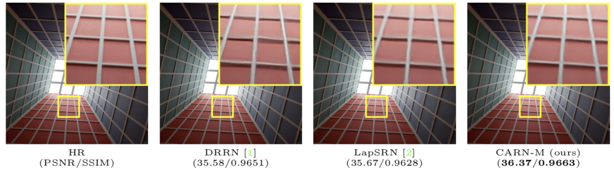
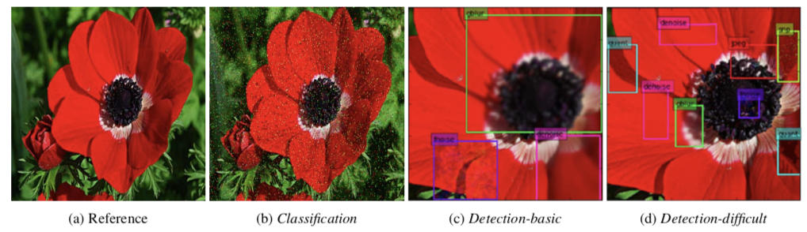

I am a PhD student at School of Computer Engineering, Ajou University (Suwon, Korea). 
My research interests are image distortion restoration (*e.g.* super-resolution) and human-AI interaction system.

[[Github]](https://github.com/nmhkahn) [[Linkedin](https://www.linkedin.com/in/nmhkahn)] [[Resume](./assets/index/Resume.pdf)] 
email: nmhkahn at gmail dot com

## Publications
<table cellspacing="15">
<tbody>
  <tr>
    <td width="25%">
      
    </td>
    <td>
      <b>Fast, Accurate, and, Lightweight Super-Resolution with Cascading Residual Network</b> 
      Namhyuk Ahn, Byungkon Kang, Kyung-Ah Sohn 
      arXiv preprint arXiv:1803.08664 
      [<a href="https://arxiv.org/abs/1803.08664">arXiv</a>]
      [<a href="https://github.com/nmhkahn/CARN-pytorch">GitHub</a>]
      [<a href="./assets/index/paper/arxiv2018.bibtex">Bibtex</a>]
    </td>
  </tr>
  <tr>
    <td width="25%">
      
    </td>
    <td>
      <b>Image Distortion Detection using Convolutional Neural Network</b> 
      Namhyuk Ahn, Byungkon Kang, Kyung-Ah Sohn 
      In ACPR, 2017. 
      [<a href="./assets/index/paper/acpr2017.pdf">pdf</a>]
      [<a href="./assets/index/paper/acpr2017.bibtex">Bibtex</a>]
    </td>
  </tr>
</tbody>
</table>

## Teaching Experience
Lecture Instructor, **Fastcampus** (Aug 2017 - Aug 2017) 
&nbsp;&nbsp;&nbsp;&nbsp;\- Taught deep learning and TensorFlow on Fastcampus Data Science School as an instructor. 
&nbsp;&nbsp;&nbsp;&nbsp;\- Slides and codes are available on [here](https://github.com/nmhkahn/deep_learning_tutorial) (korean).

Lecture TA, **Naver** (May 2017 - Jun 2017) 
&nbsp;&nbsp;&nbsp;&nbsp;\- Responsible for supporting TensorFlow exercise session as a teaching assistant.
